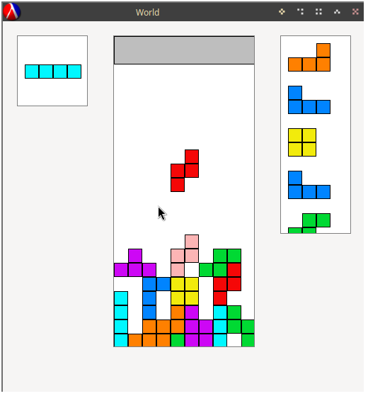

A simple Tetris made in Racket.
This project has two goals:
- Clean, readable code
- A playable modern Tetris that follows the official [Tetris guideline](https://tetris.wiki/Tetris_Guideline)

Due to the clean code it is easy to add new shapes,
experiment with different playground sizes,
and save game replays.

Features:
- [Super Rotation System](https://tetris.wiki/Super_Rotation_System) (wall kicks)
- Delayed auto-shift (DAS)
- Lock delay (currently can delay infinitely)
- Ghost piece
- Piece preview
- Hold piece
- Soft drop
- Hard drop

Todo:
- [ ] save replays
- [ ] pick size from GUI
- [ ] add scoring
- [ ] selectable game modes
  - [ ] non-standard shapes
  - [ ] 40L sprint
  - [ ] cheese race
- [ ] make it pretty
- [ ] limit lock delay resets

# Try it out

If you're new to Racket, the best way to try it out is with [DrRacket](https://download.racket-lang.org/).
